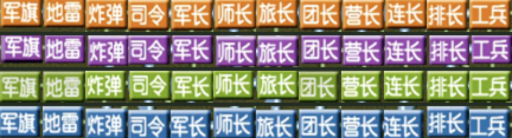

# 棋子裁剪母版与校验记录

`reference` 中保存了从用户提供的新参考截图逐枚重新裁出的 48 张明棋母版。所有母版均为 96×72 PNG；客户端使用的 36×27 BMP 位于 `legacy_gui/res/pieces`。

## 来源与坐标

- 原图尺寸：2650×1924。
- 原图 SHA-256：`4a41e06faf3f65ede6319bd64d78c90c9145329a7c29fc505b3c4e58dc60b3a8`。
- 棋子网格间距：横、纵方向均为 104 像素。
- 绿色：起点 `(1084, 150)`，直接裁剪 96×72。
- 橙色：起点 `(1084, 1277)`，直接裁剪 96×72。
- 蓝色：起点 `(484, 748)`，裁剪 72×96 后旋转 270°。
- 紫色：起点 `(1608, 748)`，裁剪 72×96 后旋转 90°。

下表坐标为各颜色网格中的 `(行, 列)`：

| 文件名 | 中文 | 橙色 | 紫色 | 绿色 | 蓝色 |
| --- | --- | --- | --- | --- | --- |
| `junqi` | 军旗 | (5, 1) | (1, 5) | (0, 3) | (3, 0) |
| `dilei` | 地雷 | (5, 0) | (3, 5) | (0, 1) | (2, 0) |
| `zhadan` | 炸弹 | (2, 1) | (4, 1) | (3, 3) | (0, 3) |
| `siling` | 司令 | (0, 2) | (0, 3) | (3, 0) | (0, 5) |
| `junzh` | 军长 | (0, 1) | (2, 4) | (1, 0) | (3, 5) |
| `shizh` | 师长 | (2, 0) | (4, 0) | (5, 3) | (0, 2) |
| `lvzh` | 旅长 | (4, 1) | (2, 0) | (5, 0) | (2, 5) |
| `tuanzh` | 团长 | (1, 0) | (4, 4) | (0, 4) | (0, 4) |
| `yingzh` | 营长 | (0, 0) | (2, 1) | (1, 4) | (1, 5) |
| `lianzh` | 连长 | (3, 0) | (1, 2) | (2, 4) | (4, 5) |
| `paizh` | 排长 | (0, 3) | (4, 2) | (1, 1) | (0, 0) |
| `gongb` | 工兵 | (1, 2) | (3, 4) | (1, 2) | (2, 4) |

## 自动校验

- 文件数量：48 张母版、48 张对应客户端图片；暗棋不计入参考图裁剪。
- 尺寸：母版全部为 96×72；客户端图片全部为 36×27、24 位 BMP。
- 文字与方向：将母版放大 4 倍后使用中文文字识别，48/48 均与文件名对应的中文棋子名称完全一致。
- 唯一性：48 张客户端图片的 SHA-256 均不重复。
- 颜色中位数 RGB：橙 `(212, 126, 47)`、紫 `(150, 95, 172)`、绿 `(144, 175, 68)`、蓝 `(92, 128, 174)`，四组颜色区分正确。
- 人工总览顺序：每行依次为军旗、地雷、炸弹、司令、军长、师长、旅长、团长、营长、连长、排长、工兵；行顺序为橙、紫、绿、蓝。

