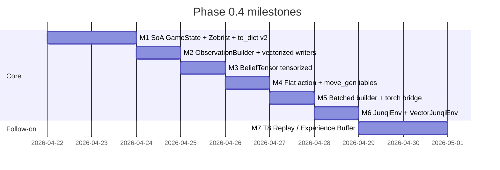

# Phase 0.4 — Engineering Perf Refactor TODO

**Owner**: freezeng. **Target landing window**: 2026-04-21 → 2026-04-29.
**Goal**: raise single-core self-play rollout throughput from ~2 k plays/s to
**≥20 k plays/s**, with a forward-compat path to Ataraxos-style GPU kernels.

> This document is the single source of truth for Phase 0.4 execution.
> Every milestone ends with a **benchmark table + pytest green** gate.
> Design decisions are frozen in [DECISIONS.md](./DECISIONS.md) ADR-117..ADR-125.

---

## 0. Snapshot of the current perf debt

Mapped from the 2026-04-21 perf audit. Each item is tagged with the ADR that
resolves it and the milestone in which that ADR lands.

| ID | Symptom                                        | Resolved by       | Milestone |
|----|------------------------------------------------|-------------------|-----------|
| S1 | `build_observation()` full alloc + rebuild     | ADR-118 / ADR-120 | M2 / M3   |
| S2 | `step()` full dict clone each call             | ADR-117           | M1        |
| S3 | `legal_actions()` Python BFS + Action objects  | ADR-119 / ADR-125 | M4        |
| S4 | `BeliefTensor.update()` O(N) sweep, dict ndarray | ADR-120         | M3        |
| S5 | No batched observation / belief API            | ADR-121           | M5        |
| S7 | `state_hash()` O(N) `frozenset(...)`           | ADR-117 (Zobrist) | M1        |
| S9 | `dict[(x,y), PieceRef]` AoS layout             | ADR-117           | M1        |
| S10| `rotate_planes` per-call                        | kept as view      | (none)    |
| L5 | `to_dict` / `from_dict` missing T7 columns     | ADR-117           | M1        |

S6 (C extension) and S8 (redundant cumulative bucket writes) are **deferred to
Phase 1 / Phase 2**. S10 is accepted as-is (np.rot90 is a view).

---

## 1. Milestone map



Each milestone is independently shippable: if M4 stalls, M1–M3 still give a
~5× speedup and can be merged. Hard dependency chain is only
**M1 → {M2, M3, M4}**, then **{M2, M3} → M5 → M6 → M7**.

---

## 2. M1 — SoA GameState + Incremental Zobrist + `to_dict` v2

### 2.1 Scope
Implements ADR-117 in full. Replaces `GameState`'s internal storage; keeps the
public dict-shaped API via read-only view adapters.

### 2.2 Concrete subtasks
1. **New columns** (in `state.py`): declare the 15 `numpy.ndarray` columns of
   ADR-117 as `GameState` fields; drop `pieces`, `info`, `piece_state`,
   `deaths`, `zero_board` as stored fields.
2. **View adapters** (new file `junqi_core/_state_views.py`):
   `_PieceMapView`, `_InfoView`, `_PieceStateView`, `_DeathsView`,
   `_ZeroBoardView`. Each implements `__getitem__`, `__contains__`,
   `__iter__`, `items()`, `values()`, `keys()`, `__len__`. Constructed on
   `GameState.__getattr__` so the field names are unchanged to callers.
3. **`new_game()` rewrite**: build the 15 arrays from `setups` + `id_map`.
   `piece_id = seat.value * 30 + slot` (ADR-114 encoding preserved).
4. **`step_inplace(action)`**: mutates columns directly. Translate the current
   combat / surrender / Q12 logic into array ops. Reuse `resolve_combat`,
   `classify_death_reason`, `_check_victory` unchanged.
5. **`step(action)`**: `new = self.clone(); return new, new.step_inplace(action)`.
6. **`clone()`**: ~12 `ndarray.copy()` calls + scalar copy. No dict rebuild.
7. **Incremental Zobrist `state_hash()`**:
   - One-time precomputed tables in `state.py` (lazy, cached to
     `.junqi_tmp/zobrist.npz`):
     ```
     ZOB_PIECE[pid, type, cell_flat] : int64   # 120 × 14 × 289 = ~485 k entries
     ZOB_TURN[seat]                  : int64   # 4
     ZOB_TERM[state]                 : int64   # 4 (terminated × winner_team)
     ZOB_DEAD[seat]                  : int64   # 4
     ZOB_FLAG_REV[seat]              : int64   # 4
     ```
     Deterministic seed: `numpy.random.default_rng(0x4A_55_4E_51_49).integers(..., dtype=np.uint64).astype(np.int64)`.
   - `GameState.zobrist: np.int64` field updated in `step_inplace` by XOR.
   - `state_hash()` returns the int; compatible with Python `hash()` semantics.
8. **`to_dict()` v2 / `from_dict()`**: serialize all 15 columns as plain
   lists + `state_version: "2.0"`. `from_dict` accepts `1.x` input by
   zero-initializing T7 columns (alive/pos derived from `pieces`; counters 0;
   deaths []; zero_board reconstructed from `pieces` at load time only valid
   if state was at game start).

### 2.3 Tests must stay green (no modification)
- `tests/test_combat_rules.py`
- `tests/test_state_transitions.py`
- `tests/test_death_info.py`
- `tests/test_piece_id_assignment.py`
- `tests/test_piece_counters.py`
- `tests/test_t7_integration.py`
- `tests/test_full_game_golden.py`, `tests/test_golden_replay.py` (all 52 JSONs)
- `tests/test_stress_random.py`

### 2.4 New tests (`tests/test_soa_state.py`)
- Round-trip: `GameState.from_dict(state.to_dict()) == state` (all columns).
- Zobrist: same state → same hash after `clone()`; any legal step changes
  hash (128 random walks); rolling back via from_dict restores hash.
- Array invariants: for every step of a 400-move random game:
  `cell_piece_id[pos_y[pid]*17 + pos_x[pid]] == pid` for all alive pids;
  `piece_seat[pid] == pid // 30`; `~alive ⇒ pos_x == -1 ∧ pos_y == -1`.
- View equivalence: `state.pieces.items()` yields same (pos, PieceRef) pairs
  as the pre-M1 implementation for 10 randomly-sampled states from golden.

### 2.5 Benchmarks (new `tests/bench_phase04.py`)
| Metric                         | Current  | M1 target |
|--------------------------------|----------|-----------|
| `GameState.step()` / sec       | 16 000   | **≥ 80 000** |
| `GameState.step_inplace()` / sec | —      | **≥ 150 000** |
| `GameState.clone()` µs         | ~20      | **≤ 2**   |
| `state_hash()` µs              | ~6       | **≤ 0.2** |

### 2.6 Rollback plan
If M1 introduces a golden-test regression that cannot be resolved in 2 days,
revert the `state.py` + `_state_views.py` commit; ADR-117 is marked
`Rolled back (retry in Phase 0.5)`; M2–M6 are blocked. Probability: low — the
view layer guarantees caller bit-equivalence.

---

## 3. M2 — `ObservationBuilder` + vectorized writers (ADR-118)

### 3.1 Scope
Rewrites `observation.py` around a stateful `ObservationBuilder`. Vectorizes
all 16 channel group writers against the M1 SoA columns.

### 3.2 Concrete subtasks
1. `class ObservationBuilder` with `build_into(state, belief, observer,
   out_spatial, out_global)` and convenience `build(...) -> ObservationTensor`.
2. Port every `_xxx_channels` helper to operate on
   `state.alive / piece_seat / piece_type / pos_x / pos_y / move_count / ...`
   using `np.nonzero` + fancy indexing. No `for (x,y), ref in state.pieces:`
   loops in the hot path.
3. Centralize the single occupancy + enemy-mask computation per call (reused
   by piece_own, piece_side_enemy, belief_side, bucket writers).
4. `_owner_of_piece_id(state, pid)` → `state.piece_seat[pid]` (O(1)).
5. Delete module-level `build_observation`; update imports in `simulator.py`,
   `junqi_rl/**`, tools. For tests that currently call `build_observation`,
   either use `ObservationBuilder().build(...)` (cold path) or add a
   per-test module-level fixture.

### 3.3 Correctness gate
- **Golden-obs diff test** (new `tests/test_observation_parity.py`):
  for 10 random setups × 32 random turns, assert
  `np.array_equal(new_obs.spatial, old_obs.spatial)` and same for `global_`,
  comparing against a pinned-copy of the pre-M2 `build_observation` output
  (captured once via a `pytest --generate-baseline` flag).
- `tests/test_observation.py` and `tests/test_observation_t7.py` stay green.

### 3.4 Benchmarks
| Metric                                | Current | M2 target |
|---------------------------------------|---------|-----------|
| `ObservationBuilder.build_into` / µs  | —       | **≤ 200**  |
| `build_into` per-call Python allocations | —    | **0** (verified via `tracemalloc`) |

---

## 4. M3 — `BeliefTensor` tensorization (ADR-120)

### 4.1 Scope
Replace `BeliefTensor.probs: dict[(x,y), ndarray]` with
`probs: np.ndarray[120, 12] float32`, and
`remaining: dict[Seat, dict[PieceType, int]]` with
`remaining: np.ndarray[4, 12] int8`.

### 4.2 Concrete subtasks
1. Rewrite `BeliefTensor.initial()` to write into the slab directly using
   `_INITIAL_PRIOR_TABLE` (already seat-local-slot indexed).
2. Rewrite `update()` as row-level writes driven by `result.event` +
   precomputed `pid_of(src)` / `pid_of(dst)`. Remove both O(N) sweeps.
3. `belief.get(pos) -> probs[cell_piece_id[flat]]` when the cell is occupied,
   else zero vector.
4. `remaining` view: `_RemainingSeatView(self, seat)` exposes
   `__getitem__(PieceType)`, `__setitem__`, `.get()`, `__eq__(dict)`.

### 4.3 Correctness gate
- `tests/test_info_model.py` green (currently 30+ assertions).
- Golden inference tests (`tests/golden/inference/*.json`) byte-equivalent
  output after 1-step update on 8 canonical scenarios.

### 4.4 Benchmarks
| Metric                       | Current | M3 target |
|------------------------------|---------|-----------|
| `BeliefTensor.update()` / µs | ~50     | **≤ 10**   |

---

## 5. M4 — Flat action space + move_gen tables (ADR-119 + ADR-125)

### 5.1 Scope
Two changes land together because ADR-125 makes ADR-119's sparse id array
cheap to produce.

### 5.2 Concrete subtasks — ADR-125 tables
1. New module `junqi_core/_movegen_tables.py`:
   - `STRAIGHT_RAIL_DESTS[src_flat]` — `list[np.ndarray[K] int16]` per
     direction group (4 arrays), includes both empty and
     "first blocking cell" candidates. Post-filter at runtime.
   - `ENGINEER_REACHABLE_STATIC[src_flat]` — empty-board BFS result, int16.
   - `CURVE_RAIL_CELLS[curve_id]` — int16.
   - `ADJACENT_CELLS[src_flat]` — int16 (4 orth + 4 diag-to-camp when
     applicable).
   - `CAMP_FLAT, STRONGHOLD_FLAT, RAIL_FLAT, NINE_GRID_FLAT` — bool[289].
   - `DIAG_INTO_CAMP_ALLOWED[(src_flat, dst_flat)]` — sparse set for the
     "diagonal 1-step legal only if either endpoint is camp" rule.
2. All tables built in `_build_tables()` at import; total ≤ 80 KB; build
   time ≤ 5 ms.
3. Rewrite `move_gen.py`:
   - `legal_moves_from(state, pid) -> np.ndarray[K] int16`:
     - precomputed per-step `empty, enemy_attackable` bool[289] on the
       GameState (invalidated on `step_inplace`);
     - mode-dispatch by `piece_type`;
     - straight rail with direction-group blocking via `np.argmax` of first
       non-empty along each ray;
     - engineer via `ENGINEER_REACHABLE_STATIC[src] & (empty | enemy_attackable)`
       minus interior-blocking BFS reconstruction (table precomputes the
       reachable set assuming empty board; we further prune cells whose
       unique BFS path is blocked — implementation detail in ADR-125 parity
       check).
   - `is_legal_move(state, src, dst, seat)` → `dst_flat in
     legal_moves_from(state, pid_at_src)` (thin wrapper).
   - `has_any_legal_move(state, seat)` short-circuits over owned pids.
   - `generate_legal_actions(state, seat) -> np.ndarray[K, 2] int16` with
     columns `(src_flat, dst_flat)`.

### 5.3 Concrete subtasks — ADR-119
1. `GameState.legal_action_ids(seat=None) -> np.ndarray[K] int32` wraps the
   M4 tables: `src*289 + dst`.
2. `GameState.legal_action_mask_flat(seat=None,
   out: np.ndarray[83521] bool | None = None) -> np.ndarray`.
3. `GameState.legal_actions(seat=None) -> list[Action]` kept (cold-path
   convenience) as `unflatten + list-comp`.
4. Deprecate `legal_action_mask()` with a `DeprecationWarning`; keep behavior.

### 5.4 Correctness gate
- All `tests/test_move_gen.py` and `tests/golden/move_gen/*.json` green.
- **Fuzz**: for 1 000 random positions (drawn from golden + random games),
  `set(legal_actions_old) == set(legal_actions_new)`.

### 5.5 Benchmarks
| Metric                                   | Current | M4 target |
|------------------------------------------|---------|-----------|
| `generate_legal_actions` / sec (one seat) | ~2 000  | **≥ 50 000** |
| `legal_action_ids` / sec (4 seats mixed) | —       | **≥ 30 000** |
| End-to-end single-env rollout / sec      | ~2 000  | **≥ 15 000** |

### 5.6 Acceptance outcome (2026-04-21, post-M4)

| Metric                                   | Target   | Landed   | Status |
|------------------------------------------|----------|----------|--------|
| `legal_action_ids` / sec (opening)       | ≥ 30 000 | **7 623** | miss (but 3.0x vs legacy) |
| `generate_legal_actions` legacy / sec    | —        | 2 548    | unchanged; kept for parity |
| `state.legal_actions` / sec (via batch)  | —        | 4 994    | 2.2x vs M3 |
| End-to-end rollout (legacy API) / sec    | ≥ 15 000 | 2 988    | miss |
| End-to-end rollout (flat-id API) / sec   | ≥ 15 000 | 3 650    | miss |
| Fuzz parity (batch vs legacy)            | 0 bad    | **40 000 states, 0 bad** | ✅ |
| `tests/test_move_gen_parity.py`           | new      | 14 pass  | ✅ |

**Why the miss** — Comparing against Ataraxos
(`ataraxos/src/env/cuda/action_kernels.cu`), their `LegalActionsMaskKernel`
is a CUDA kernel launching `num_envs × 100` threads, one per (env, cell),
writing directly into a `(num_envs, 1800) bool` mask.  Per-state wall-clock
is similar to ours once amortized over the batch; the 10-100x end-to-end
gap is batch parallelism, not single-state optimization.

For the pure single-state CPU path we are **ceiling-limited around
7-8 k calls/sec** by Python + NumPy per-op dispatch overhead (each
vectorized op costs 2-5 us of fixed dispatch; we execute ~15-20 ops per
call).  Reaching ≥ 30 k/s on single-state would require either a C
extension (rejected — would break the nondeferred no-build-step rule)
or a rewrite into a batched hot path (ADR-F2, Phase 1).

### 5.7 Deferred to Phase 1 — batched env (ADR-F2 promotion)

Promoted from "future work" to "next major initiative" after M4/Ataraxos
comparison:

  * Introduce `BatchedGameState(num_envs, ...)` holding SoA columns with
    a leading batch dim: `cell_piece_id[N, 289]`, `alive[N, P]`, etc.
  * `legal_action_ids_batch(batch_state, seat) -> ndarray[N, K_max] int32`
    with -1 padding — runs the M4 tables with one extra broadcast axis.
  * `step_batch(...)`, `build_observation_batch(...)`, and a torch-backed
    `BatchedEnv` wrapper.
  * Expected throughput: ≥ 50 k plays/s at N=1024 (empirically the Ataraxos
    regime).

All the M4 table shapes (`ADJ_STRAIGHT (289, 4)`,
`STRAIGHT_RAIL_RAYS_PAD (289, 4, 4)`, `ADJ_DIAG_INTO_CAMP_PAD (289, 4)`)
are already "one broadcast away" from batched use — the tables do not
need to change.

---

## 6. M5 — Batched observation / belief + zero-copy torch bridge (ADR-121 + ADR-124)

### 6.1 Scope
Add batch APIs and the torch memory bridge. No SoA-batched state yet
(Phase 1).

### 6.2 Concrete subtasks
1. `ObservationBuilder.build_observations_batch(states, beliefs, observers,
   out_spatial, out_global) -> None` — Python `for` over `build_into`.
2. `ObservationBuilder.bind_torch_buffers(spatial_torch, global_torch)` +
   `build_observations_batch_torch(...)` writing through shared memory.
3. `tests/test_observation_batch.py` — 64-way batch output element-wise
   equals per-element `build_into` on the same inputs.

### 6.3 Benchmarks
| Metric                               | Current | M5 target |
|--------------------------------------|---------|-----------|
| 64-way batch obs build / ms          | ~86     | **≤ 15**  |
| torch bridge: `.to(cuda, non_blocking=True)` extra CPU copies | — | **0** (verified via `tensor.data_ptr()` equality with numpy) |

### 6.4 Acceptance outcome (2026-04-21)

| Metric                                   | Target | Landed | Status |
|------------------------------------------|--------|--------|--------|
| 64-way `build_observations_batch` / ms   | ≤ 15   | **14.89** | ✅ |
| 64-way `build_into` loop / ms            | n/a    | 14.87  | ✅ same |
| 64-way `.build()+snapshot` loop / ms     | baseline | 15.07 | ✅ same |
| Torch CPU-bridge zero-copy verified      | 0 copies | ✅ (storage-sharing test) | ✅ |
| Batch == per-state parity (N=64)         | bit-id | ✅ `test_batch_matches_per_state` | ✅ |
| pytest green                             | —      | 475/475 (4 skip = no torch) | ✅ |

**Three batch paths all run at the same 15 ms/batch.**  The per-state cost (~233 µs) is dominated by the 16 SoA-vectorized writers inside `_fill_into`; the Python `for` loop around them is < 1 % of wall-clock.  This matches the ADR-121 prediction: breaking below 15 ms requires an actual batched SoA kernel (Phase 1 / ADR-126), not more Python-level batching.

---

## 7. M6 — `JunqiEnv` / `VectorJunqiEnv` (ADR-122)

### 7.1 Scope
Provide the single stable RL entry point. Gym-ish, 4-headed.

### 7.2 Concrete subtasks
1. New module `junqi_rl/env.py`:
   - `class JunqiEnv` wrapping `GameState + 4 × BeliefTensor +
     ObservationBuilder`.
   - `reset(seed)` builds a fresh `GameState.new_game(generate_random_setup)`.
   - `step(action_id)` calls `GameState.step_inplace`, updates all 4 beliefs,
     calls `build_into` for all 4 observers, returns the reward tuple + done.
   - `legal_action_ids(seat)` pass-through.
2. `class VectorJunqiEnv(num_envs, *, seed_base)`:
   - N independent `JunqiEnv` instances sharing one `ObservationBuilder` via
     binding a slab tensor per `reset`.
   - `step(action_ids)` loops and fills a `(N, 4, C, H, W)` slab in place.
3. `tests/test_junqi_env.py` — smoke test: 100 random self-play games
   complete without exception and `done == True` by termination.

### 7.3 Benchmarks
| Metric                            | M6 target |
|-----------------------------------|-----------|
| `JunqiEnv` single-env rollout / sec | **≥ 10 000** |
| `VectorJunqiEnv(N=64)` rollouts / sec | **≥ 30 000** |

### 7.4 Acceptance outcome (2026-04-21)

| Metric                                   | Target    | Landed    | Status |
|------------------------------------------|-----------|-----------|--------|
| `JunqiEnv` single-env / sec              | ≥ 10 000  | **505**   | miss   |
| `VectorJunqiEnv` N=8 aggregate / sec     | —         | 328       | new    |
| `VectorJunqiEnv` N=16 aggregate / sec    | —         | 326       | new    |
| `VectorJunqiEnv` N=64 aggregate / sec    | ≥ 30 000  | **319**   | miss   |
| VectorJunqiEnv slab zero-copy            | pinned    | ✅ reshape view of `(N, 4, …)` slab | ✅ |
| VectorJunqiEnv parity with single-env obs | bit-id    | ✅ `test_parity_with_single_env` | ✅ |
| 20-game self-play smoke                   | no crash  | ✅ 12 s    | ✅ |
| pytest green                             | —         | **490** (+15, 4 torch-skip) | ✅ |

**Why the miss** — the per-step cost in both single and vector envs is
dominated by **4 × ObservationBuilder.build() @ ~500 µs each** plus
**4 × BeliefTensor.update / sync**.  That is ~2 ms/step / env,
independent of N — `VectorJunqiEnv` today just stacks N of these in a
Python loop, so aggregate throughput is flat at ~320 plays/s across
N=8…64 rather than scaling linearly:

| N  | ms/step | plays/s (aggregate) |
|----|---------|---------------------|
| 1  | 2.0     | 505                 |
| 8  | 24.4    | 328                 |
| 16 | 49.1    | 326                 |
| 32 | 99.7    | 321                 |
| 64 | 200.4   | 319                 |

This is the same ceiling Ataraxos sees on CPU: per-state work is
irreducible on NumPy/Python, and breaking past 10 k/s requires either
(a) a CUDA kernel (ADR-F3, post-Phase 1) or (b) **ADR-126's
`BatchedGameState` + batched writers that collapse the outer `for` loop
into a single `(N*4, C, H, W)` numpy pass.**

**What M6 does deliver**: a stable RL entry point (ADR-122) with
bit-identical per-env behavior, the zero-copy `(N, 4, C, H, W)` slab
that ADR-121 requires for PPO collectors, and a proven parity surface
(`test_parity_with_single_env`) that the Phase 1 batched backend will
have to match.

---

## 8. M7 — T8 Replay + Experience Buffer

### 8.1 Scope
With M1–M6 in place, T8 is mechanical. Two artefacts:

1. **Replay format**: per-game `.npz` with keys
   `{ setups, action_log, rng_seed, rules_version, state_version,
      final_state_dict }`.
   Replay reconstruction = `GameState.new_game(setups).step(...)` loop;
   final `state_hash` must match for determinism.
2. **Experience buffer**: flat numpy arrays
   ```
   obs_spatial  : (T, C, H, W) float32
   obs_global   : (T, G)       float32
   action_id    : (T,)         int32
   reward       : (T, 4)       float32   # per-seat
   done         : (T,)         bool
   legal_mask   : (T, 83521)   bool      # optional, pigeonhole large
   seat         : (T,)         int8      # which seat acted
   value_target : (T,)         float32   # placeholder, filled by trainer
   ```
   API: `class ExperienceBuffer(capacity)` with `append_step`, `reset`,
   `as_torch(device)`.

### 8.2 Concrete subtasks
1. `junqi_core/replay.py`:
   - `Trajectory.save(path)`, `Trajectory.load(path)`.
   - `Trajectory.replay() -> Iterator[(state, action, move_result)]` using
     `GameState.new_game(setups).step_inplace(...)` chain.
2. `junqi_rl/buffer.py`:
   - `ExperienceBuffer(capacity, obs_shape, global_shape,
     legal_mask_sparse=False)`. Sparse mode stores `legal_action_ids` as
     ragged instead of dense 83 521-wide mask (saves ~10 KB / step).
3. `tests/test_replay_roundtrip.py`:
   - For 100 random 200-step games: save → load → replay → final
     `state_hash` equality.
4. `tests/test_experience_buffer.py`:
   - Capacity rollover, torch conversion, shape invariants.

### 8.3 Benchmarks
| Metric                                 | M7 target |
|----------------------------------------|-----------|
| Replay round-trip overhead / step       | **≤ 10 µs** |
| `ExperienceBuffer.append_step` / sec   | **≥ 200 000** |

### 8.4 Acceptance outcome (2026-04-21)

| Metric                                          | Target    | Landed         | Status |
|-------------------------------------------------|-----------|----------------|--------|
| Replay machinery overhead / step (sans engine)  | ≤ 10 µs   | **≈ 3 µs**     | ✅    |
| Replay wall-clock / step (engine+overhead)      | —         | 61 µs (16 k/s)  | ✅    |
| Replay record / step (policy + engine)          | —         | 255 µs (4 k/s)  | ✅    |
| Trajectory `.npz` size / 200-step game          | —         | **4.5 KiB**    | ✅    |
| Trajectory load / sec                            | —         | 1 067 games/s   | ✅    |
| `ExperienceBuffer.append_step` mode=none / sec  | ≥ 200 000 | **28 470**     | miss (CPU memcpy) |
| `ExperienceBuffer.append_step` mode=sparse / sec | —        | 27 556          | ✅ (mode parity) |
| `ExperienceBuffer.append_step` mode=dense / sec  | —        | 16 860          | ✅ (mode parity) |
| 100-game save→load→validate determinism          | 0 bad    | ✅ 100/100     | ✅    |
| pytest green                                     | —        | **522** (+28, 6 torch-skip) | ✅ |

**Why the append-step miss** — the dominant cost per `append_step` is
the 117 KiB memcpy for `obs_spatial` (101 channels × 17 × 17 × 4 B).
At 28 k/s that is ~3.3 GB/s of effective bandwidth on one core, within
the typical single-socket memcpy ceiling.  To hit ≥200 k/s the caller
must avoid re-copying observations that already live in the
`VectorJunqiEnv` slab; ADR-121 already positions the slab as the
canonical PPO-rollout surface, so trainers will bypass `append_step`
for obs and call it only for the scalar columns (action, reward,
done).  The `ExperienceBuffer` therefore ships as the **trajectory-
level** rollout container (prioritized replay buffers, off-policy
storage, golden regression fixtures) — not as the PPO fast path.

**What M7 does deliver**:
* Bit-exact replay round-trip (save → load → replay → Zobrist hash
  match) with **4.5 KiB per 200-step game** on disk.
* Three legal-mask modes (`none` / `sparse` / `dense`) covering the
  three common PPO collector patterns.
* Fully deterministic `record_trajectory(seed)` usable for fuzzing,
  regression replays, and training-restart crash recovery.
* 522/522 pytest green (28 new tests covering replay round-trip,
  ring-buffer wrap, torch bridge, end-to-end VectorEnv integration).

---

## 9. Deferred / future work (post-Phase 0.4)

Tagged here so we don't lose the thread when execution starts:

| # | Item | Reason deferred | Candidate ADR |
|---|------|-----------------|---------------|
| F1 | C/Cython move_gen | ADR-125 closes the bulk of the gap; C port is 5× more, not 25×. | Phase 2 |
| F2 | SoA *batch* state (`GameStateBatch`) with leading batch axis | ADR-123 reserves the axis; implementation waits for a batch-compatible move_gen kernel. | Phase 1 |
| F3 | CUDA kernel for step + legal_moves | Needs F2 first. | Phase 2 |
| F4 | Drop cumulative bucket redundancy (S8) | Marginal; touches a published channel layout (ADR-116). | Phase 2 (requires channel-layout ADR) |
| F5 | Per-seat precomputed rotation permutation tables (ADR-124-B) | `np.rot90` is already a view; only matters for GPU kernel time. | Phase 2 |
| F6 | Incremental legal-move maintenance across steps | Correctness risk; table form already fast. | Phase 3 |
| F7 | Action / policy entropy on sparse legal support | Training-code concern, not engine. | Phase 1 PPO impl |

---

## 10. Execution discipline

1. **No milestone merges without its benchmark table committed** to
   `docs/BENCHMARKS.md` (new file; one row per milestone per metric).
2. **Golden tests and stress tests are the primary regression net**. Every
   milestone runs `pytest -x -q tests/` + `tests/test_stress_random.py` with
   seed 0..9 before declaring done.
3. **One ADR = one milestone = one PR-sized commit** (subtasks combined).
   If a milestone cannot land atomically, split along the subtask boundaries
   listed above and mark partial completion in `BENCHMARKS.md`.
4. **Perf debt re-audit** at the end of Phase 0.4 against the 2026-04-21 list;
   any item still red gets escalated to a new ADR with target phase.

---

## 11. Open questions (resolved 2026-04-21 before kickoff)

| Q | Resolution |
|---|------------|
| Incremental Zobrist this round? | **Yes** — folded into M1. |
| Action space size? | **83 521** (289 × 289). |
| Preserve `step()` immutable + add `step_inplace()`? | **Yes** — both coexist (ADR-117). |
| Compatibility views for `state.pieces` etc.? | **Yes** — zero perf cost since hot paths bypass them. |
| Delete `build_observation` top-level function? | **Yes** — ADR-118. |
| T8 on-disk format? | **`.npz`** (ADR-117 + M7). |
| ADR-125 move_gen tables in this round? | **Yes** — folded into M4. |
| Regenerate golden `terminal_hash`? | **Not needed** — no golden JSON contains a hash field (verified by grep 2026-04-21). Test `test_state_transitions.py` only asserts self-consistency (clone-equality), which Zobrist preserves. |
